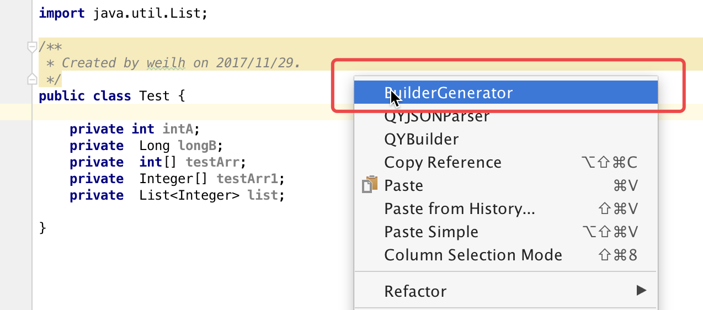
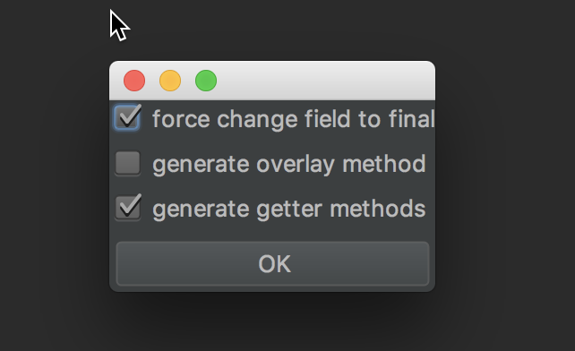

# BuilderPojoGenerator
[English](./READMEmd)  
自动生成Builder模式源码

## 下载 
在插件中心界面搜索"BuilderPojoGenerator"

## 使用说明 
进入Pojo对象界面, 右击, 选择"Builder Generator", 调整选项后点击ok。  


界面如下:  
  

## 配置  
force change field to final : 强制将字段变为final 
generate overlay method (overlay方法可以在demo中查看到)  
generate getter methods : 生成getter方法

## DEMO

原始的Pojo源码 :   

```java
public class Test {
    private final int intA;
    private final Long longB;
    private final int[] testArr;
    private final Integer[] testArr1;
   }
```  

生成的源码 :  

```java
public class Test {

    private final int intA;
    private final Long longB;
    private final int[] testArr;
    private final Integer[] testArr1;


    private final List<Integer> list;

    private Test(Builder builder) {
        this.intA = builder.intA;
        this.longB = builder.longB;
        this.testArr = builder.testArr;
        this.testArr1 = builder.testArr1;
        this.list = builder.list;
    }

    public static Builder builder() {
        return new Builder();
    }

    public int getIntA() {
        return intA;
    }

    public Long getLongB() {
        return longB;
    }

    public int[] getTestArr() {
        return testArr;
    }

    public Integer[] getTestArr1() {
        return testArr1;
    }

    public List<Integer> getList() {
        return list;
    }

    public static class Builder {
        private int intA;
        private Long longB;
        private int[] testArr;
        private Integer[] testArr1;
        private List<Integer> list;

        public Builder() {
        }

        public Builder(Test test) {
            this.intA = test.intA;
            this.longB = test.longB;
            this.testArr = test.testArr;
            this.testArr1 = test.testArr1;
            this.list = test.list;
        }

        public Builder overlay(Test test) {
            if (test == null) {
                return this;
            }
            if (test.getIntA() != 0) {
                intA = test.getIntA();
            }
            if (test.getLongB() != null) {
                longB = test.getLongB();
            }
            if (test.getTestArr() != null) {
                testArr = test.getTestArr();
            }
            if (test.getTestArr1() != null) {
                testArr1 = test.getTestArr1();
            }
            if (test.getList() != null) {
                list = test.getList();
            }
            return this;
        }

        public Builder intA(int intA) {
            this.intA = intA;
            return this;
        }

        public Builder longB(Long longB) {
            this.longB = longB;
            return this;
        }

        public Builder testArr(int[] testArr) {
            this.testArr = testArr;
            return this;
        }

        public Builder testArr1(Integer[] testArr1) {
            this.testArr1 = testArr1;
            return this;
        }

        public Builder list(List<Integer> list) {
            this.list = list;
            return this;
        }

        public Test build() {
            return new Test(this);
        }
    }
```
